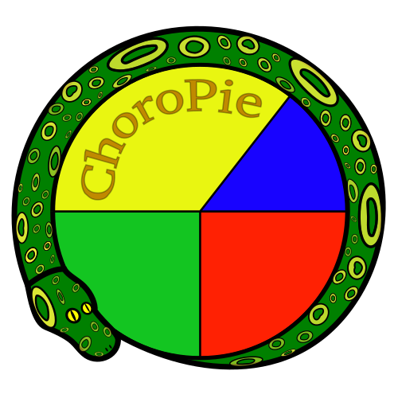

ChoroPie
===============================

version number: 0.0.1
author: Vincent Nikolayev

Overview
--------

A Basemap/Matplotlib toolkit which allows the simplified creation of choropleth maps with colorbars using shapefiles, and the combined plotting of pie charts within the centroid coordinates of the shapefile's polygons.

Installation / Usage
--------------------

To install use pip:

    $ pip install choropie

Or clone the repo:

    $ git clone https://github.com/vinceniko/choropie.git
    $ python setup.py install
    
Contributing
------------

TBD

Example
-------

TBD
